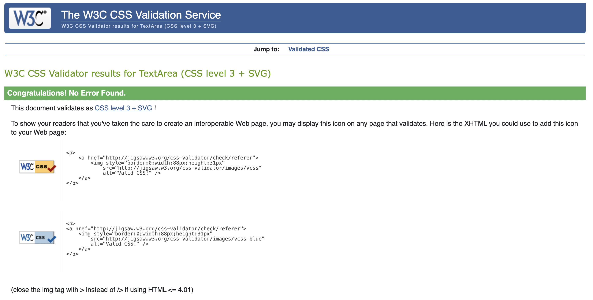
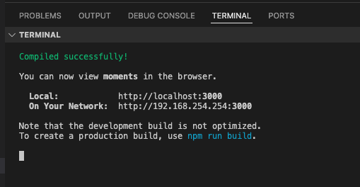

<!-- Disable warnings about inline HTML -->
<!-- markdownlint-disable MD033 -->
<!-- Disable warnings about hard tabs -->
<!-- markdownlint-disable MD010 -->

# Testing the Task Manager

Back to  [`README.md`](README.md)

## Table of Contents

## Testing User Stories

Each user story has a list of acceptance criteria, which are the expected outcomes when the story is tested. An issue is only closed if manual testing confirms that the acceptance criteria are fulfilled.  

The commits corresponding to each User Story are linked in each the GitHuB Issue.

An overview of implemented and tested User Stories can be seen in the [Google Sheet containing User Stories](https://docs.google.com/spreadsheets/d/1qZQIKNKa_nGfCR9YQQ1UFkeIGvXR_ikOx7Oev0sEVBA/edit?usp=sharing).

All User Stories in the MVP have been implemented and work as intended.

Issues outside the MVO that were not completed for the first release of the project but still intend to be done in further development work are gathered under the label [`v2`](https://github.com/blahosyl/task-manager-frontend/issues?q=is%3Aissue+label%3A%22v2%22+) in GitHub Issues.

## Code validation

### HTML validation

All rendered pages of the project were validated with the [W3C HTML validator](https://validator.w3.org). No errors or warnings were found.

All screenshots of HTML validation can be found in [this folder](/documentation-assets/testing-assets/validation/html-validation/).

> [!INFO]
> Info messages regarding trailing slashes are disregarded, since these are extensively used in React development.

#### Landing page validation

[No errors or warnings found](https://validator.w3.org/nu/?doc=https%3A%2F%2Fpp5-task-manager-frontend-eebb66e2c99d.herokuapp.com%2F)

> [!INFO]
> The Landing page and the Kanban page share the same URL, and are conditionally rendered depending on login status

#### Signin page validation

[No errors or warnings found](https://validator.w3.org/nu/?doc=https%3A%2F%2Fpp5-task-manager-frontend-eebb66e2c99d.herokuapp.com%2Fsignin)

#### Signup page validation

[No errors or warnings found](https://validator.w3.org/nu/?doc=https%3A%2F%2Fpp5-task-manager-frontend-eebb66e2c99d.herokuapp.com%2Fsignin)

#### Task Kanban page validation

[No errors or warnings found](https://validator.w3.org/nu/?doc=https%3A%2F%2F3000-blahosyl-taskmanagerfro-e3n8xmkax6p.ws.codeinstitute-ide.net%2F)

> [!INFO]
> The Landing page and the Kanban page share the same URL, and are conditionally rendered depending on login status

#### Task List page validation

[No errors or warnings found](https://validator.w3.org/nu/?doc=https%3A%2F%2F3000-blahosyl-taskmanagerfro-e3n8xmkax6p.ws.codeinstitute-ide.net%2Flist)

#### Task Detail page validation

The validated page includes comments.

[No errors or warnings found](https://validator.w3.org/nu/?doc=https%3A%2F%2F3000-blahosyl-taskmanagerfro-e3n8xmkax6p.ws.codeinstitute-ide.net%2Ftasks%2F42%2F)

#### Task Create page validation

[No errors or warnings found](https://validator.w3.org/nu/?doc=https%3A%2F%2F3000-blahosyl-taskmanagerfro-e3n8xmkax6p.ws.codeinstitute-ide.net%2Ftasks%2Fcreate)

#### Task Edit page validation

[No errors or warnings found](https://validator.w3.org/nu/?doc=https%3A%2F%2F3000-blahosyl-taskmanagerfro-e3n8xmkax6p.ws.codeinstitute-ide.net%2Ftasks%2F69%2Fedit)

#### Profile List page validation

[No errors or warnings found](https://validator.w3.org/nu/?doc=https%3A%2F%2F3000-blahosyl-taskmanagerfro-e3n8xmkax6p.ws.codeinstitute-ide.net%2Fteam)

#### Profile Detail page validation

[No errors or warnings found](https://validator.w3.org/nu/?doc=https%3A%2F%2F3000-blahosyl-taskmanagerfro-e3n8xmkax6p.ws.codeinstitute-ide.net%2Fprofiles%2F3)

### CSS validation

All custom `css` files were validated with [Jigsaw](https://jigsaw.w3.org/css-validator/validator), which uncovered a few minor issue that were corrected (see the commits in [#154](https://github.com/blahosyl/task-manager-frontend/issues/154)).
The resulting code passed without errors or warnings for all files.

In addition, each JS file was manually checked for comment coverage and unused code at the end of development [(#154)](https://github.com/blahosyl/task-manager-frontend/issues/154).

### JavaScript/JSX validation

[EsLint](https://marketplace.visualstudio.com/items?itemName=dbaeumer.vscode-eslint) was used throughout development to validate the code.
No errors or warnings are present in the project.

In addition, each JS file was manually checked for comment coverage, and formatted with the [Prettier extension for VS Code](https://marketplace.visualstudio.com/items?itemName=esbenp.prettier-vscode) at the end of development [(#155)](https://github.com/blahosyl/task-manager-frontend/issues/155).

## Manual feature testing

### Navigation & authentication manual testing

#### Navigation bar | desktop manual testing | user not logged in

|Action    |Expected result |Result|
|---    |---    |:---: |
|page loads    |hamburger icon not visible & nav links visible|✅|
|Signin link clicked |[Signin page](#signin-page-manual-testing) loaded|✅|
|Signup link clicked |[Signup page](#signup-page-manual-testing) loaded|✅|
|logo and brand name clicked|[landing page](#landing-page-manual-testing) loaded|✅|

*Click to play video*

https://github.com/user-attachments/assets/3e75947f-d47b-4733-8145-a9d32d3e8607

#### Navigation bar | mobile manual testing

|Action    |Expected result |Result|
|---    |---    |:---: |
|page loads    |hamburger icon visible logo and brand name visible nav links not visible|✅|
|hamburger icon clicked|nav bar opens|✅|
|hamburger icon clicked again OR user clicks outside the nav bar |nav bar closes|✅|

*Click to play video*

https://github.com/user-attachments/assets/f7fe5e11-ef0d-4b3f-81e6-7fd65ec1ea61

#### Footer manual testing

|Action    |Expected result |Result|
|---    |---    |:---: |
|page loads    |copyright info visible GitHub icon visible LinkedIn icon visible|✅|
|GitHub icon clicked | GitHub profile opens in new tab|✅|
|LinkedIn icon clicked | LinkedIn profile opens in new tab

*Click to play video*

https://github.com/user-attachments/assets/cd5a5289-0cca-4a91-92df-aa96990ff9d3

#### Landing page manual testing

This page is only available to logged out users.

|Action				|Expected result	|Result|
|---				|---				|:---:	|
|page loads    |Welcome text visible Signup link visible Signin link visible landing background image visible|✅|

*Click to play video*

#### Signup page manual testing

This page is only available to logged out users.

|Action				|Expected result	|Result|
|---				|---				|:---:	|
|Signup page loads    |Signup text visible Signin link visible email field visible username field visible password field visible password (again) field visible Signup button visible|✅|
|Signin link clicked|[Signin page](#signin-page-manual-testing) loads|✅|
|Signup button clicked any field empty |validation message appears|✅|
|Signup button clicked password fields don't match OR password does not conform to rules |validation message appears|✅|
|Signup button clicked username already exists|validation message appears|✅|
|Signup button clicked all fields filled correctly |user is signed up [Signin page](#signin-page-manual-testing) loads|✅|

*Click to play video*

https://github.com/user-attachments/assets/d2b935ed-6d7a-43b3-bfed-9e38f8b6a33f

#### Signin page manual testing

This page is only available to logged out users.

|Action				|Expected result	|Result|
|---				|---				|:---:	|
|page loads    |Signin text visible Signup link visible username field visible password field visible Signup link visible signin background image visible|✅|
|Signup link clicked|[Signup page](#signup-page-manual-testing) loaded|✅|
|Signin button clicked any field empty |validation message appears|✅|
|Signin button clicked both fields filled credentials not correct|validation message appears|✅|
|Signin button clicked both fields filled credentials correct|user is signed in [Task Kanban page](#task-kanban-manual-testing) loads [navigation bar icons change](#navigation-bar--desktop-manual-testing--user-logged-in)|✅|

*Click to play video*

https://github.com/user-attachments/assets/ec23d8a9-c8de-4926-8351-cd4227a4159a

#### Navigation bar | desktop manual testing | user logged in

|Action    |Expected result |Result|
|---    |---    |:---: |
|page loads    |hamburger icon not visible & nav links visible|✅|
|**plus icon** clicked |[TaskCreate Form](#task-create-form-manual-testing) loaded|✅|
|**boards icon** clicked |[Task Kanban page](#task-kanban-manual-testing) loaded|✅|
|**list icon** clicked |[Task list page](#task-list-manual-testing) loaded|✅|
|**sign out icon** clicked |user is signed out & [navigation bar icons change](#navigation-bar--desktop-manual-testing--user-not-logged-in)|✅|
|logo and brand name clicked|[Task Kanban page](#task-kanban-manual-testing) loaded|✅|

*Click to play video*

https://github.com/user-attachments/assets/6d0a7526-d34f-4827-b899-b1539d26ceb8

### Tasks manual testing

#### Task Tabs manual testing

Tabbed filtering of tasks is enabled on the following pages:

- [Task Kanban](#task-kanban-manual-testing)
- [Task List](#task-list-manual-testing)
- [Profile Detail](#profile-detail-manual-testing)

|Action				|Expected result	|Result|
|---				|---				|:---:	|
|Task Kanban or Task List page loads|4 tabs visible: **assigned to**, **watched by** & **created by** the *logged-in user*, "all tasks"|✅|
|Profile Detail page loads|3 tabs visible: **assigned to**, **watched by** & **created by** the *viewed user*|✅|
|page loads|[search field](#task-search-manual-testing) is visible|✅|
|page loads|**assigned to** tab content is visible|✅|
|page loads|user-specific tabs have a task count in parentheses next in their label|✅|
|user clicks on a tab|that tasks's content becomes visible without having to reload the page|✅|
|user watches/unwatches a task|tab counts and contents update without having to reload the page|✅|
|Kanban only: user deletes a task|tab counts and contents update without having to reload the page|✅|

*Click to play video*

https://github.com/user-attachments/assets/d581e92f-29d8-405f-b6e7-e616c4f60504

#### Task Kanban manual testing

|Action				|Expected result	|Result|
|---				|---				|:---:	|
|page loads|tasks appear in [tabbed](#task-tabs-manual-testing) task list format|✅|
|page loads|3 columns visible on each tab: **To Do**, **In Progress** & **Done**, with tasks sorted accordingly|✅|
|page loads|[**Teammates** link](#profile-list-manual-testing) appears next to the search bar|✅|
|page loads|[Infinite Scroll](#infinite-scroll-manual-testing) is active in each column|✅|
|page loads|each task card's color is set according to task prioriy|✅|
|page loads|**vertical dots** icon visible for each task owned by the logged-in user|✅|
|**vertical dots** icon clicked|**pencil** and **trashcan** icons appear|✅|
|user clicks outside edit/delete menu|**pencil** and **trashcan** icons disappear|✅|
|**pencil** icon clicked|[Task Edit Form](#task-edit-form-manual-testing) opens|✅|
|**trashcan** icon clicked|[task deletion](#task-deletion-manual-testing) modal opens|✅|
|**Teammates** link clicked | [**Profile List page**](#profile-list-manual-testing) opens|✅|

*Click to play video*

https://github.com/user-attachments/assets/dcc5587b-28a9-4880-b4af-f1e07c735443

#### Task List manual testing

|Action				|Expected result	|Result|
|---				|---				|:---:	|
|page loads|tasks appear in [tabbed](#task-tabs-manual-testing) task list format|✅|
|page loads|[**Teammates** list](#profile-list-manual-testing) appears to the right of to the task list showing user picture and [conditional name](README.md/#conditionally-rendered-names)|✅|
|page loads|the logged-in user does not appear in the [**Teammates** list](#profile-list-manual-testing)|✅|
|page loads|[Infinite Scroll](#infinite-scroll-manual-testing) is active in task list|✅|
|page loads|[Infinite Scroll](#infinite-scroll-manual-testing) is active in **Teammates** list|✅|
|page loads|each task card's color is set according to task prioriy|✅|
|page loads|**vertical dots** icon visible for each task owned by the logged-in user|✅|
|**vertical dots** icon clicked|**pencil** and **trashcan** icons appear|✅|
|user clicks outside edit/delete menu|**pencil** and **trashcan** icons disappear|✅|
|**pencil** icon clicked|[Task Edit Form](#task-edit-form-manual-testing) opens|✅|
|**trashcan** icon clicked|[task deletion](#task-deletion-manual-testing) modal opens|✅|
|**Teammates** link clicked | [**Profile List page**](#profile-list-manual-testing) opens|✅|
|user avatar in **Teammates** list clicked | [**Profile Detail page**](#profile-detail-manual-testing) for corresponding user opens|✅|

*Click to play video*

https://github.com/user-attachments/assets/cc0dc324-36bc-48f4-b05a-f2f339043bd4

#### Task Detail manual testing

|Action				|Expected result	|Result|
|---				|---				|:---:	|
|Task Detail page loads|assignee or "not assigned" visible status visible priority visible title visible excerpt visible (if any) due date visible watch icon visible description visible (if any) "last updated on" visible "created on" visible **created by** visible image visible (if any) comment field visible [comments](#comments-manual-testing) visible (if any)|✅|
|logged in user owns task|**vertical dots** icon visible on top right|✅|
|**vertical dots** icon clicked|**pencil** and **trashcan** icons appear|✅|
|user clicks outside edit/delete menu|**pencil** and **trashcan** icons disappear|✅|
|**pencil** icon clicked|[Task Edit Form](#task-edit-form-manual-testing) opens|✅|
|**trashcan** icon clicked|[task deletion](#task-deletion-manual-testing) modal opens|✅|

*Click to play video*

https://github.com/user-attachments/assets/68506a43-cfaa-4a1a-bc0a-559b608be9ba

#### Task Search manual testing

A search bar appears on the [Task List](#task-list-manual-testing), [Task Kanban](#task-kanban-manual-testing) and [Profile Detail](#profile-detail-manual-testing) pages.

The contents of Task objects can be searched. Fields searched are:

- title
- excerpt
- description
- assignee
- owner

|Action				|Expected result	|Result|
|---				|---				|:---:	|
|page loads|search bar visible|✅|
|user types in search bar|tasks are filtered with a few second's delay after the user starts typing|✅|
|there are tasks matching the search string|only the matching tasks are listed from the active tab|✅|
|there are no tasks matching the search string|information message appears with "not found" asset|✅|
|user click on another tab|search bar content & search result fintering is cleared|✅|

*Click to play video*

https://github.com/user-attachments/assets/501060e2-661b-4cfa-b382-13980ef286c7

#### Task Create Form manual testing

|Action				|Expected result	|Result|
|---				|---				|:---:	|
|page loads|empty task create form visible|✅|
|title field empty|**create** button disabled  instruction text shown below button|✅|
|title field filled|**create** button enabled  instruction text below button disappears|✅|
|**cancel** button clicked |new task not created confirmation message appears|✅|
|**create** button clicked |new task created confirmation message appears|✅|

*Click to play video*

https://github.com/user-attachments/assets/4eeefa89-8c9e-407e-b9a6-75326bb7f28e

#### Task Edit Form manual testing

|Action				|Expected result	|Result|
|---				|---				|:---:	|
|page loads|task edit form visible, populated with task data|✅|
|title field filled|**save** button enabled  instruction text below button not shown|✅|
|title field content is deleted|**save** button disabled  instruction text shown below button|✅|
|title field filled again|**save** button enabled  instruction text below button disappears|✅|
|**cancel** button clicked |task data not updated confirmation message appears|✅|
|**save** button clicked |task data updated confirmation message appears|✅|

*Click to play video*

https://github.com/user-attachments/assets/7b58f43b-a165-4679-86c4-1a5b32e89a59

#### Task Deletion manual testing

|Action				|Expected result	|Result|
|---				|---				|:---:	|
|**cancel** button clicked on delete modal |delete modal closes task is not deleted confirmation message appears|✅|
|**delete** button clicked on delete modal|task is deleted user is redirected to Kanban page confirmation message appears|✅|

*Click to play video*

https://github.com/user-attachments/assets/466a2b33-3082-4d72-9d8c-fe39fe1e5d62

### Comments manual testing

|Action				|Expected result	|Result|
|---				|---				|:---:	|
|Task Detail page loads|comment field visible comment button visible|✅|
|logged in user has previous comments|**vertical dots** icon visible for each comment belonging to the user|✅|
|comment button clicked comment field empty|comment button is disabled|✅|
|comment button clicked comment field not empty|comment appears in comment list  **vertical dots** icon appears next to comment confirmation message appears|✅|
|**vertical dots** icon clicked|**pencil** and **trashcan** icons appear|✅|
|user clicks outside edit/delete menu|**pencil** and **trashcan** icons disappear|✅|
|**pencil** icon clicked|comment text filled into comment field **save** & **cancel** buttons appear|✅|
|**cancel** button clicked|comment text not updated confirmation message appears|✅|
|**save** button clicked|comment text updated confirmation message appears|✅|
|**trashcan** icon clicked|comment is deleted confirmation message appears|✅|

*Click to play video*

https://github.com/user-attachments/assets/e7f9b2d8-60ac-49c3-ab3e-5e57f9630709

### Watchers manual testing

The watch/unwatch functionality is available in every Task view apart from the Task Create & Edit Forms.

|Action				|Expected result	|Result|
|---				|---				|:---:	|
|page loads|watch icon is visible on task card  watcher count visible on task card|✅|
|user hovers over **eye outline** icon|"watch" tooltip appears|✅|
|user hovers over **solid eye** icon|"unwatch" tooltip appears|✅|
|user clicks **eye outline** icon|watcher count increases by one  icon changes to **solid eye** watched [tab](#task-tabs-manual-testing) updated accordingly|✅|
|user clicks **solid eye** icon|watcher count decreases by one  icon changes to **eye outline** watched [tab](#task-tabs-manual-testing) updated accordingly|✅|

*Click to play video*

https://github.com/user-attachments/assets/696cb742-5e80-4592-b34a-07b37817f0e7

### Profiles manual testing

#### Profile List manual testing

|Action				|Expected result	|Result|
|---				|---				|:---:	|
|page loads|[**Teammates** list](#profile-list-manual-testing) appears in full page view displaying each user's picture, [conditional name](README.md/#conditionally-rendered-names), pronouns (if any), role (if any)|✅|
|page loads|the logged-in user does not appear in the list|✅|
|page loads|[Infinite Scroll](#infinite-scroll-manual-testing) is active in **Teammates** list|✅|
|user avatar in **Teammates** list clicked | [**Profile Detail page**](#profile-detail-manual-testing) for corresponding user opens|✅|

*Click to play video*

https://github.com/user-attachments/assets/0a3576e6-35ed-4e52-8006-237c725290c2

#### Profile detail manual testing

|Action				|Expected result	|Result|
|---				|---				|:---:	|
|page loads & profile belongs to logged-in user|profile details appear|✅|
|page loads & profile doesn't belong to logged-in user|avatar, [conditional name](README.md/#conditionally-rendered-names) & any filled-in profile fields appear|✅|
|page loads|tasks related to the user appear in a [tabbed](#task-tabs-manual-testing) [task list](#task-list-manual-testing) format|✅|
|logged in user owns profile|**pencil** icon visible on top right|✅|
|**pencil** icon clicked|**pencil with notepad**, **id card** & **key** icons appear with corresponding descriptions|✅|
|user clicks outside edit menu|**pencil with notepad**, **id card** & **key** icons and corresponding descriptions disappear|✅|
|**pencil with notepad** icon clicked|[Profile Edit Form](#profile-edit-manual-testing) opens|✅|
|**id card** icon clicked|[Username Edit form](#username-edit-manual-testing) opens|✅|
|**key** icon clicked|[Password Edit form](#password-edit-manual-testing) opens|✅|
|page loads|[**Teammates** list](#profile-list-manual-testing) appears to the right of to the task list showing user picture and [conditional name](README.md/#conditionally-rendered-names)|✅|
|page loads|the logged-in user does not appear in the [**Teammates** list](#profile-list-manual-testing)|✅|
|page loads|[Infinite Scroll](#infinite-scroll-manual-testing) is active in **Teammates** list|✅|
|**Teammates** link clicked | [**Profile List page**](#profile-list-manual-testing) opens|✅|
|user avatar in **Teammates** list clicked | [**Profile Detail page**](#profile-detail-manual-testing) for corresponding user opens|✅|

*Click to play video*

https://github.com/user-attachments/assets/a6268030-33d8-4acd-9a1e-2b9ec78bcd3f

#### Profile edit manual testing

|Action				|Expected result	|Result|
|---				|---				|:---:	|
|page loads|profile edit form visible, filled with existing data|✅|
|**cancel** button clicked |profile data not updated confirmation message appears|✅|
|**save** button clicked |profile data updated confirmation message appears|✅|

*Click to play video*

https://github.com/user-attachments/assets/277c6ce4-69aa-473e-bcb2-aa06febc7969

#### Username edit manual testing

|Action				|Expected result	|Result|
|---				|---				|:---:	|
|page loads|username edit form visible, filled with existing username|✅|
|**cancel** button clicked |username not updated confirmation message appears|✅|
|**save** button clicked & username is not valid|validation message appears|✅|
|**save** button clicked & username is valid|username updated confirmation message appears|✅|

*Click to play video*

https://github.com/user-attachments/assets/0462409f-090d-46f2-a3eb-0fc6802e770d

#### Password edit manual testing

|Action				|Expected result	|Result|
|---				|---				|:---:	|
|page loads|password edit form visible|✅|
|**cancel** button clicked|password not updated confirmation message appears|✅|
|**save** button clicked  & password fields are empty |validation message appears|✅|
|**save** button clicked  & passwords do not match |validation message appears|✅|
|**save** button clicked  & passwords are not valid |validation message appears|✅|
|**save** button clicked  & passwords match and are valid |password updated confirmation message appears|✅|

*Click to play video*

https://github.com/user-attachments/assets/6969fd12-531a-4b99-8362-eb87a9c7e15a

### General features

#### Infinite scroll manual testing

Infinite scroll is used to load the next page of data from the API. It is used for the following components

- [Tasks](#tasks-manual-testing)
- [Comments](#comments-manual-testing)
- [Profiles](#profiles-manual-testing)

|Action    |Expected result |Result|
|---    |---    |:---: |
|page loads|first 10 objects in a list are loaded the objects appearing on the page can be less because of filtering|✅|
|scrolls down within the component| another page of objects is loaded|✅|
|there are no more objects to load| and end message appears after the list|✅|

*Click to play video*

https://github.com/user-attachments/assets/51279d9a-bb54-4bfc-bbf8-08379bf121ca

#### Notifications manual testing

Notification messages are used to confirm CRUD actions in the following components:

- [Tasks](#tasks-manual-testing)
- [Comments](#comments-manual-testing)
- [Profiles](#profiles-manual-testing)

|Action    |Expected result |Result|
|---    |---    |:---: |
|notification is triggered   |notification appears in the top right corner|✅|
|user clicks notification| notification disappears right after click|✅|
|user does not click notification| notification disappears when the timer bar runs out|✅|

*Click to play video*

https://github.com/user-attachments/assets/29897dbb-e529-49fe-b40f-870f50910770

## Accessibility testing

### Lighthouse

The following pages have been tested with Lighthouse emulating both a mobile and a desktop use case:

- landing page
- signin page
- signup page
- task kanban page
- task list page
- task detail page
- task create page
- task edit page
- profile list page
- profile detail page

The accessibility audits uncovered some minor issues with color contrasts and heading precedence. These were all corrected (see the commits of [the corresponding Issue](https://github.com/blahosyl/task-manager-frontend/issues/149)), so that the final accessibility audit result for all pages tested is 100%.

All accessibility reports can be found in [this folder](documentation-assets/testing-assets/lighthouse/).

### Color

In addition to Lighthouse, color contrasts were also tested with the [WebAIM Contrast Checker](https://webaim.org/resources/contrastchecker). This was especially important given that tasks have multiple color schemes conditionally rendered depending on their priority.

Where contrast did not meet at least AA standard, the colors were changed.

As pointed out by my mentor, the orange color of the navbar icons does not need to reach high contrast with the background, since it is always accompanied by a corresponding text indicating where the nav link leads.

#### High specifications

|color name  |HEX code|
|---   |--- |
|very-dark-high|#531D04|
|dark-high|#D7410F|
|light-high|#f7ddcf|

### Medium theme specifications

|color name  |HEX code|
|---   |--- |
|very-dark-med|#530E0E|
|dark-med|#992319|
|light-med|#FBEDE5|

### Low theme

|color name  |HEX code|
|---   |--- |
|very-dark-low|#07565A|
|dark-low|#0A8385|
|light-low|#D1FAF3|

### Neutral color specifications

|color name  |HEX code|
|---   |--- |
|light-neutral|#F9FAFC|
|white|#FFFFFF|
|light-gray|#dadadf|
|gray |#242a3d|

#### High theme contrast check

| color 1 |color 2 |contrast | [WCAG AA/AAA](https://ialabs.ie/what-is-the-difference-between-wcag-a-aa-and-aaa/) |Comment|
|---   |---  |:---:  |:---:| ---|
|very-dark-high  |white          |13.58:1  |AAA| |
|very-dark-high  |light-high  |10.48:1  |AAA| |
<!-- |very-dark-high 	|med-orange 	|5.28:1 	|AA| Only used for large text| -->
|very-dark-high  |light-neutral  |13:01:1  |AAA| |
|dark-high     |white          |4.51:1  |AA | Only used for large text|
|dark-high     |light-high  |3.48:1  |AA|Only used for icon|

#### Medium theme contrast check

| color 1 |color 2 |contrast | [WCAG AA/AAA](https://ialabs.ie/what-is-the-difference-between-wcag-a-aa-and-aaa/) |Comment|
|---   |---  |:---:  |:---:| ---|
|very-dark-med  |white          |14.61:1  |AAA| |
|very-dark-med  |light-med  |12.76:1  |AAA| |
<!-- |very-dark-med 	|med-blue 	|4.6:1 	|AAA|Only used for large text| -->
<!-- |very-dark-med  |light-neutral  |12.04:1  |AAA| | -->
|dark-med     |white          |8.04:1  |AAA | Only used for large text|
|dark-med     |light-med  |7.03:1  |AAA|Only used for icon|

#### Low theme contrast check

| color 1 |color 2 |contrast | [WCAG AA/AAA](https://ialabs.ie/what-is-the-difference-between-wcag-a-aa-and-aaa/) |Comment|
|---   |---  |:---:  |:---:| ---|
|very-dark-low  |white          |8.44:1  |AAA| |
|very-dark-low  |light-low  |7.5:1  |AAA| |
<!-- |very-dark-low 	|med-green 	|6.68:1 	|AAA|Only used for large text| -->
<!-- |very-dark-low  |light-neutral  |9.2:1  |AAA| | -->
|dark-low     |white          |4.56:1  |AA | Only used for large text|
|dark-low     |light-low  |4.06   :1  |AA|Only used for icon|

## Automated testing

## Bugs

All bugs are tracked in [GitHub Issues](https://github.com/blahosyl/task-manager-frontend/issues?q=is%3Aissue+label%3Abug).

### Known bugs

Known bugs are listed in [GitHub Issues](https://github.com/blahosyl/task-manager-frontend/issues?q=is%3Aissue+label%3Abug+is%3Aopen).

### Solved bugs

Solved bugs are listed in [GitHub Issues](https://github.com/blahosyl/task-manager-frontend/issues?q=is%3Aissue+label%3Abug+is%3Aclosed).

#### Expected errors in the Console

- 3 401 (unauthorized) errors on mount/refresh
- 401 when visiting the Signin or Signup pages
- 400 errors when sending incorrect form data
- a 401 (unauthorized) error when refreshing the access token
